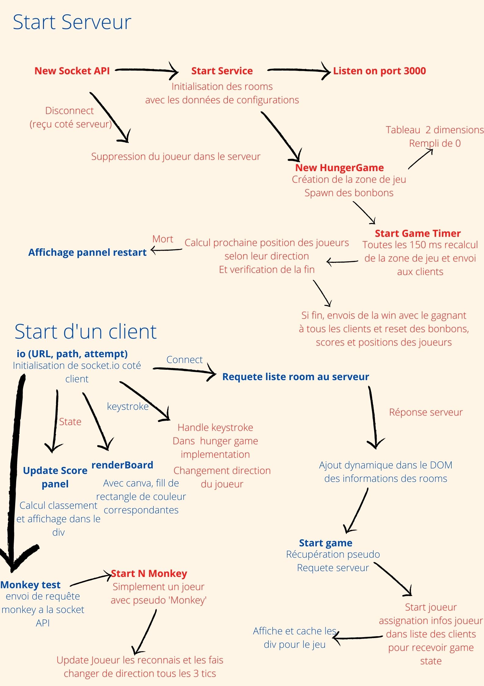

# Hunger Game

Un jeu HungerGame implémenté en fonction de l'énoncé du projet SR, ESIR 2020.

Mis en place en utilisant nodejs pour la partie serveur et socket.io pour la communication client/serveur.
Déployé sur internet en utilisant une machine virtuelle Ubuntu de l'istic.

## Démo 

Voir la version [démo](http://148.60.11.162:8000/) de Hunger Game !

## Image Docker 

L'image Docker est disponible [içi](https://hub.docker.com/repository/docker/vincentlarreur/hungergame/general).

## Rapport 

Voir le [rapport](https://docs.google.com/document/d/1ZdQjy_KrKsZRNxp86dYisYeUfszlGgCPhhkym1GT03s/edit?usp=sharing) concernant ce projet et son développement.

## Work Flow Général



## Auteurs

Vincent Larreur & Mohamed Amine Laafoudi

## Commandes du projet

Construction de l'image Docker
```
make build
```
Lancement de l'application \
->(Paramètre SERVER_URI_PARAM afin de spécifier l'url)
```
make start
```
Exemple pour le déploiement sur vm de l'istic
```
make start SERVER_URI_PARAM="http://148.60.11.162:8000/"
```
Arrêt de l'application
```
make stop
```
Suppression de l'image docker
```
make clean
```
Rechargement de l'application
```
make reload
```
